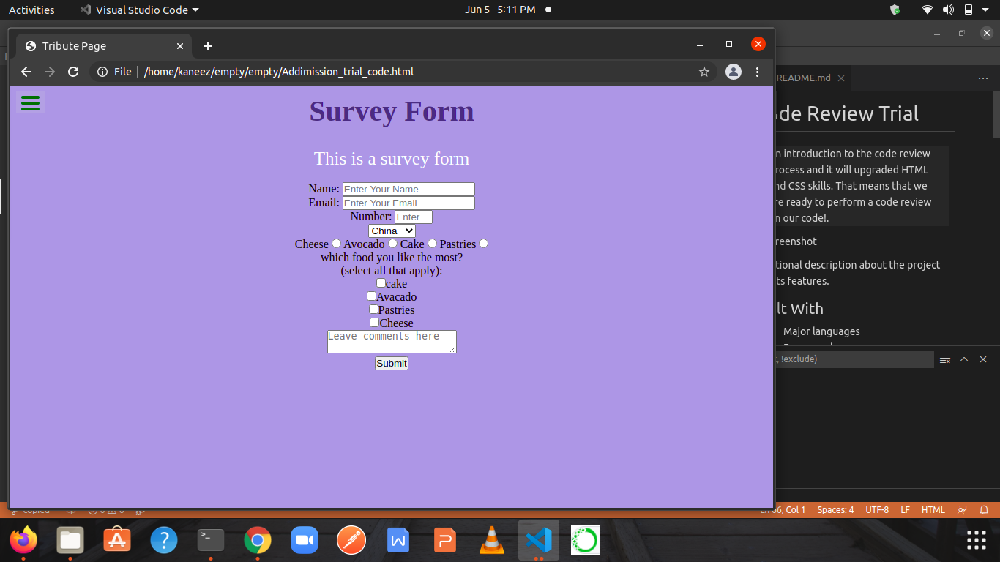

# project-review

> An introduction to the code review process and it will upgraded HTML and CSS skills. That means that we are ready to perform a code review on our code!.

Additional description about the project and its features.

## Built With

- Major languages
HTML and CSS 
## Live Demo

[Live Demo Link]( https://kaneez98fatima.github.io/project-review/)

## GProject REquirements

**Create a new empty repo.
Copy your code from the project that you completed during the Admissions Trial:
 - If you do not have the code from the Admissions Trial ask someone from your Standup Team to share their code with you. - In that case, remember to add an attribution note and acknowledgment in your README file.
- Create a new branch for your copied code.
Open a pull request..**

To get a local copy up and running follow these simple example steps.

### Setup
Linter Det up required 

### Install

VS code 
### Usage
 For Learning Purpose 

## Authors

👤 **Kaneez Fatima**

- GitHub: [@Kaneez98fatima](https://github.com/githubhandle)
- LinkedIn: [@Kaneez98Fatima](https://linkedin.com/in/linkedinhandle)

## 🤝 Contributing

Contributions, issues, and feature requests are welcome!

Feel free to check the [issues page](../../issues/).

## Show your support

Give a ⭐️ if you like this project!

## Acknowledgments

- Code is copied by the Addmission trial project 

## 📝 License

This project is [MIT](./MIT.md) licensed.
